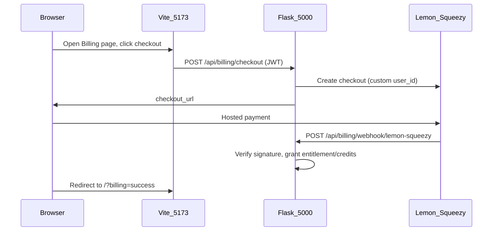

# Billing Configuration How-To

This guide explains how to enable optional billing in the Vanilla WebApp Framework. The demo ships with **Lemon Squeezy** as the default provider; the same checkout flow supports donations, fixed-price spot purchases, and credit top-ups (see plan templates in [`backend/billing/plans.py`](../backend/billing/plans.py)).

**Implementing a new payment provider in code** (adapter, tests) is documented for agents in [`backend/AGENTS.md`](../backend/AGENTS.md) → *Billing — add a payment provider*. This file covers **dashboard and environment setup only**.

## Overview

Billing is optional. Checkout is disabled until **`LEMON_SQUEEZY_API_KEY`** and **`LEMON_SQUEEZY_STORE_ID`** are set (and the variant id for each plan you enable). The active adapter is selected by **`BILLING_PROVIDER`** (default `lemon_squeezy`).

| Provider key | Status | Env vars (minimum) |
|--------------|--------|-------------------|
| `lemon_squeezy` | Implemented | `LEMON_SQUEEZY_API_KEY`, `LEMON_SQUEEZY_STORE_ID`, `LEMON_SQUEEZY_WEBHOOK_SECRET`, `LEMON_SQUEEZY_VARIANT_ID_SUPPORTER` |
| `stripe` | Stub only | Not configured — see [`backend/billing/providers/stripe.py`](../backend/billing/providers/stripe.py) |

API endpoints:

| Endpoint | Auth | Purpose |
|----------|------|---------|
| `GET /api/billing/plans` | Public | List checkout plans (provider ids omitted) |
| `GET /api/billing/status` | Bearer JWT | User entitlements + credit balance |
| `POST /api/billing/checkout` | Bearer JWT | Create hosted checkout; returns `{ "checkout_url": "..." }` |
| `POST /api/billing/webhook/lemon-squeezy` | Provider signature | Lemon Squeezy webhook receiver |

### Provider consoles

| Provider | Console URL |
|----------|-------------|
| Lemon Squeezy | [https://app.lemonsqueezy.com/](https://app.lemonsqueezy.com/) |

## Shared setup (all providers)

Configure these once in `.env` (see [`.env.example`](../.env.example)):

| Topic | Development | Production |
|-------|-------------|------------|
| `FRONTEND_URL` | `http://localhost:5173` | Public app URL (e.g. `https://example.com`) |
| `OAUTH_REDIRECT_BASE` | `http://localhost:5173` (same as SPA origin in dev) | Same public URL |
| Webhook URL pattern | `{FRONTEND_URL or OAUTH_REDIRECT_BASE}/api/billing/webhook/<provider>` | Same on HTTPS |
| Browser origin | `http://localhost:5173` (Vite proxies `/api` to Flask) | Single Flask origin on `:5000` |
| `BILLING_PROVIDER` | `lemon_squeezy` (default) | Same unless you swap adapters |

**Steps:**

1. Copy `.env.example` to `.env` and add billing credentials for your provider.
2. **Restart Flask** after changing `.env`.
3. In development, run both servers and use **`:5173`** in the browser (not `:5000`):

   ```bash
   # Terminal 1 — API on :5000
   cd backend && flask run

   # Terminal 2 — SPA on :5173
   cd frontend && npm run dev
   ```

4. Verify plans are exposed:

   ```bash
   curl http://localhost:5173/api/billing/plans
   ```

   Example: response includes a `supporter` plan when the catalog is loaded.

5. **Local webhooks:** Lemon Squeezy (and most providers) cannot POST to `localhost`. Use a tunnel (ngrok, cloudflared, etc.) and register the **public HTTPS URL** in the provider dashboard, pointing at `/api/billing/webhook/lemon-squeezy`. Without a reachable webhook, checkout can succeed but entitlements/credits are **not** granted in the app.

### Checkout and webhook flow



Entitlements and credits are updated **only after** a verified webhook is processed. The billing page shows a success banner after redirect; status refreshes when the webhook has been applied.

---

## Lemon Squeezy

**Console:** [Lemon Squeezy](https://app.lemonsqueezy.com/)

The framework demo uses a **pay-what-you-want** `supporter` plan (custom amount, minimum $5.00 USD). You need one **product/variant** in Lemon Squeezy mapped to `LEMON_SQUEEZY_VARIANT_ID_SUPPORTER`.

### 1. Create store and product

1. Sign in at [app.lemonsqueezy.com](https://app.lemonsqueezy.com/).
2. Create or select a **Store** — copy the **Store ID** (Settings → Store).
3. Create a **Product** with at least one **Variant**:
   - For the demo donation plan, enable **Pay what you want** (or equivalent custom pricing) on the variant.
   - Copy the **Variant ID** from the variant URL or API.

### 2. API key

1. Go to **Settings → API**.
2. Create an API key with permission to create checkouts.
3. Copy the key into `.env`:

   ```env
   LEMON_SQUEEZY_API_KEY=your-api-key
   LEMON_SQUEEZY_STORE_ID=your-store-id
   LEMON_SQUEEZY_VARIANT_ID_SUPPORTER=your-variant-id
   ```

### 3. Webhook

1. Go to **Settings → Webhooks** (store or account level per Lemon Squeezy UI).
2. Create a webhook with URL:

   - Development (via tunnel): `https://<your-tunnel-host>/api/billing/webhook/lemon-squeezy`
   - Production: `https://<your-domain>/api/billing/webhook/lemon-squeezy`

3. Subscribe at minimum to:

   - `order_created` — one-time purchases (donations, spot buys, credit packs)
   - Subscription events if you enable recurring plans: `subscription_created`, `subscription_updated`, `subscription_cancelled`, `subscription_expired`, `subscription_paused`, `subscription_unpaused`, `subscription_payment_success`, `subscription_payment_failed`

4. Copy the **Signing secret** into `.env`:

   ```env
   LEMON_SQUEEZY_WEBHOOK_SECRET=your-signing-secret
   ```

5. Restart Flask.

### 4. Test mode

Use Lemon Squeezy **test mode** while developing. Complete a test checkout from the app menu → **Billing**. Confirm:

- Webhook received (check provider dashboard or `{PROJECT_FOLDER}/logs/app.log`).
- `GET /api/billing/status` (with JWT) shows the new entitlement or credit balance.
- Demo gated route `GET /api/supporter-badge` returns 200 after a successful `supporter` donation.

### Adding more plans

Edit [`backend/billing/plans.py`](../backend/billing/plans.py) (uncomment fork templates or add entries), create matching variants in Lemon Squeezy, and add env vars such as `LEMON_SQUEEZY_VARIANT_ID_SPOT`. Human steps mirror the supporter variant above.

---

## Stripe

**Status:** Not implemented. The repository includes a **stub adapter** and migration notes only.

- Code template: [`backend/billing/providers/stripe.py`](../backend/billing/providers/stripe.py)
- Agent recipe: [`backend/AGENTS.md`](../backend/AGENTS.md) → *Billing — add a payment provider*

When Stripe is implemented, add a **Stripe** section here with dashboard steps (Checkout Session, webhook signing secret, price ids). Do not document fake console steps until the adapter exists.

---

## Troubleshooting

| Symptom | Likely cause | Fix |
|---------|--------------|-----|
| Checkout returns `BILLING_NOT_CONFIGURED` | Missing API key or store id | Set `LEMON_SQUEEZY_API_KEY` and `LEMON_SQUEEZY_STORE_ID`; restart Flask |
| Checkout fails / 502 | Invalid variant id or API error | Confirm `LEMON_SQUEEZY_VARIANT_ID_SUPPORTER` matches the variant in Lemon Squeezy; check logs |
| Payment succeeds but no entitlement | Webhook not received or invalid signature | Use a public tunnel in dev; verify `LEMON_SQUEEZY_WEBHOOK_SECRET`; check webhook URL path |
| Webhook returns 400 `WEBHOOK_INVALID` | Wrong signing secret or altered body | Re-copy secret from dashboard; ensure no middleware modifies raw body |
| `amount below minimum` on checkout | Donation below plan minimum | Demo `supporter` plan minimum is 500 cents ($5.00) |
| Billing page works on `:5000` but checkout/webhook odd in dev | Browser not on Vite origin | Use `http://localhost:5173`; set `FRONTEND_URL` for redirect after payment |
| Duplicate webhook anxiety | Provider retries | Safe — events are idempotent via `billing_events` table |

---

## Production checklist

1. Run database migrations (billing tables are in migration `004`):

   ```bash
   alembic -c backend/alembic.ini upgrade head
   ```

2. Build the frontend and serve from Flask:

   ```bash
   cd frontend && npm run build
   APP_PROFILE=production flask run
   ```

3. Set `FRONTEND_URL` to your public HTTPS origin.

4. Register production webhook URL in Lemon Squeezy: `https://<your-domain>/api/billing/webhook/lemon-squeezy`.

5. Switch Lemon Squeezy from test mode to live when ready.

6. Verify:

   ```bash
   curl https://<your-domain>/api/billing/plans
   ```

7. Complete a live checkout and confirm `GET /api/billing/status` reflects the purchase.
