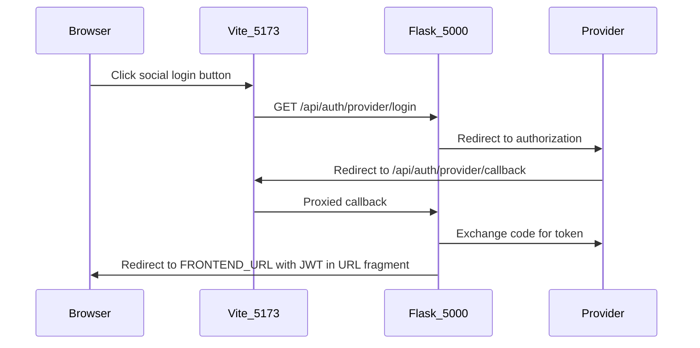

# OAuth Configuration How-To

This guide explains how to enable optional social login for **Google**, **Facebook**, and **X (Twitter)** in the Vanilla WebApp Framework.

## Overview

Social login is optional. Each provider is enabled only when **both** its `*_CLIENT_ID` and `*_CLIENT_SECRET` are set in `.env`. Providers are implemented in [`backend/api/oauth.py`](../backend/api/oauth.py):

| Provider key | UI label | Env vars |
|--------------|----------|----------|
| `google` | Google | `GOOGLE_CLIENT_ID`, `GOOGLE_CLIENT_SECRET` |
| `facebook` | Facebook | `FACEBOOK_CLIENT_ID`, `FACEBOOK_CLIENT_SECRET` |
| `twitter` | X (Twitter) | `TWITTER_CLIENT_ID`, `TWITTER_CLIENT_SECRET` |

API endpoints:

| Endpoint | Purpose |
|----------|---------|
| `GET /api/auth/providers` | List enabled providers |
| `GET /api/auth/<provider>/login` | Start OAuth (redirects to provider) |
| `GET /api/auth/<provider>/callback` | Provider callback; issues JWT |

### Provider consoles

| Provider | Console URL |
|----------|-------------|
| Google | [https://console.cloud.google.com/](https://console.cloud.google.com/) |
| Facebook | [https://developers.facebook.com/](https://developers.facebook.com/) |
| X (Twitter) | [https://developer.x.com/](https://developer.x.com/) |

## Shared setup (all providers)

Configure these once in `.env` (see [`.env.example`](../.env.example)):

| Topic | Development | Production |
|-------|-------------|------------|
| `OAUTH_REDIRECT_BASE` | `http://localhost:5173` | Public app URL (e.g. `https://example.com`) |
| `FRONTEND_URL` | `http://localhost:5173` | Same public URL |
| Redirect URI pattern | `{OAUTH_REDIRECT_BASE}/api/auth/{provider}/callback` | Same |
| Browser origin | `http://localhost:5173` (Vite proxies `/api` to Flask) | Single Flask origin on `:5000` |

**Steps:**

1. Copy `.env.example` to `.env` and add credentials for each provider you want.
2. **Restart Flask** after changing `.env`. OAuth clients register at startup in [`backend/__init__.py`](../backend/__init__.py).
3. In development, run both servers and use **`:5173`** in the browser (not `:5000`):

   ```bash
   # Terminal 1 — API on :5000
   cd backend && flask run

   # Terminal 2 — SPA on :5173
   cd frontend && npm run dev
   ```

4. Verify enabled providers:

   ```bash
   curl http://localhost:5173/api/auth/providers
   ```

   Example response when Google is configured: `["google"]`

### OAuth flow



After a successful login, the SPA reads `#token=...` from the URL fragment (see [`frontend/src/js/app.js`](../frontend/src/js/app.js)), stores the JWT in `localStorage`, and sets `isLoggedIn`.

---

## Google

Uses OpenID Connect via Authlib with scopes `openid email profile`.

**Console:** [Google Cloud Console](https://console.cloud.google.com/)

1. Sign in at [https://console.cloud.google.com/](https://console.cloud.google.com/) and create or select a project.
2. Go to **APIs & Services → OAuth consent screen**.
   - Choose **External** (or **Internal** for Google Workspace).
   - Fill in app name, support email, and developer contact.
   - While the app is in **Testing**, only users you add as test users can sign in.
3. Go to **APIs & Services → Credentials → Create credentials → OAuth client ID**.
   - Application type: **Web application**.
4. Under **Authorized redirect URIs**, add:
   - Development: `http://localhost:5173/api/auth/google/callback`
   - Production: `https://<your-domain>/api/auth/google/callback`
5. Copy **Client ID** and **Client secret** into `.env`:

   ```env
   GOOGLE_CLIENT_ID=your-client-id.apps.googleusercontent.com
   GOOGLE_CLIENT_SECRET=your-client-secret
   ```

6. Restart Flask and confirm `google` appears in `/api/auth/providers`.

---

## Facebook

**Console:** [Meta for Developers](https://developers.facebook.com/)

This app uses standard **Facebook Login** (not [Facebook Login for Business](https://developers.facebook.com/docs/facebook-login/facebook-login-for-business/)) with permissions `public_profile` and `email`. The callback URL is:

```
{OAUTH_REDIRECT_BASE}/api/auth/facebook/callback
```

### What you need

| Item | Local dev | Production |
|------|-----------|------------|
| Meta **app** (App ID + Secret) | Yes | Yes |
| Business portfolio | No | May be required for App Review |
| App published (Live) | No — keep **Unpublished** | Yes |
| Redirect URI in Meta settings | No — `localhost` is auto-allowed in dev | Yes — register your HTTPS URL |
| App Review for `email` | No | Yes |

You must create a **Meta app** at [developers.facebook.com](https://developers.facebook.com/). A [business portfolio](https://www.facebook.com/business/help/1710077379203657) alone does not provide OAuth credentials.

### Setup

#### 1. Create the app

1. Go to [developers.facebook.com](https://developers.facebook.com/) → **Create App**.
2. Select the use case **Authenticate and request data from users with Facebook Login** ([setup guide](https://developers.facebook.com/docs/facebook-login/create-an-app)).
3. Do **not** choose **Business** app type or **Facebook Login for Business**.

#### 2. Add permissions (do not skip)

1. **Use cases** → **Customize** your Facebook Login use case.
2. Open **Permissions**.
3. Add **`email`**. Keep **`public_profile`** (usually already present).

If `email` is missing, Facebook shows **Invalid Scopes: email** and blocks login.

#### 3. OAuth settings

1. In the same use case, open **Settings**.
2. Under **Client OAuth Settings**, ensure **Client OAuth Login** and **Web OAuth Login** are **On**.
3. **Redirect URIs (development):** while the app is **Unpublished**, Meta allows `http://localhost` automatically. You do **not** need to add `http://localhost:5173/api/auth/facebook/callback` manually. If you do, Meta may show a warning — that is fine; remove the entry or ignore it.
4. **Redirect URIs (production):** add `https://<your-domain>/api/auth/facebook/callback` and click **Save changes**.

#### 4. Configure `.env` and restart

Copy **App ID** and **App Secret** from **App settings → Basic**:

```env
FACEBOOK_CLIENT_ID=your-app-id
FACEBOOK_CLIENT_SECRET=your-app-secret
FRONTEND_URL=http://localhost:5173
OAUTH_REDIRECT_BASE=http://localhost:5173
```

Restart Flask, then verify:

```bash
curl http://localhost:5173/api/auth/providers
# ["facebook"]
```

#### 5. Test login

1. Run Flask and Vite; open **http://localhost:5173**.
2. Your Facebook account must have a **role on the app** (Admin, Developer, or Tester) while the app is Unpublished.
3. Click **Facebook** → **Continue** on the consent screen.

An orange banner such as *Submit for login review* is **normal in development**. It does not block you from clicking **Continue** as an app admin/developer.

### Production

Before switching the app to **Live**:

1. Register `https://<your-domain>/api/auth/facebook/callback` in Facebook Login settings.
2. Complete [App Review](https://developers.facebook.com/docs/development/build-and-test/) for Advanced Access to `email` and `public_profile`.
3. Set `FRONTEND_URL` and `OAUTH_REDIRECT_BASE` to your public HTTPS origin.

---

## X (Twitter)

Uses OAuth 2.0 with PKCE (scopes: `users.read`, `tweet.read`, `offline.access`).

**Console:** [X Developer Portal](https://developer.x.com/)

1. Sign in at [https://developer.x.com/](https://developer.x.com/) and create a project and app.
2. Enable **OAuth 2.0** for the app.
3. App type: **Web App**, confidential client (Client ID + Client Secret).
4. Set **Callback URL**:
   - Development: `http://localhost:5173/api/auth/twitter/callback`
   - Production: `https://<your-domain>/api/auth/twitter/callback`
5. Add to `.env`:

   ```env
   TWITTER_CLIENT_ID=your-client-id
   TWITTER_CLIENT_SECRET=your-client-secret
   ```

6. Restart Flask and confirm `twitter` appears in `/api/auth/providers`.

**Important:** X does not return an email address. The app uses the X username as the display name and generates a local username from it. OAuth-only Twitter accounts will have `email` set to `null` in the database.

---

## Troubleshooting

| Symptom | Likely cause | Fix |
|---------|--------------|-----|
| Social button grayed out or "not configured" | Missing env vars or Flask not restarted | Set both `*_CLIENT_ID` and `*_CLIENT_SECRET`; restart Flask |
| `redirect_uri_mismatch` from provider | Redirect URI in provider console does not match | Register exactly `{OAUTH_REDIRECT_BASE}/api/auth/<provider>/callback` |
| Facebook **Invalid Scopes: email** | `email` permission not added to the use case | Use cases → Customize → Permissions → add **email** |
| Facebook localhost URI warning | `localhost` is auto-allowed when the app is Unpublished | Remove the manual entry or ignore; no action needed in dev |
| Facebook **Submit for login review** banner | App not reviewed yet — expected in dev | Click **Continue** if you are an app Admin/Developer/Tester |
| Facebook login blocked for a user | App is Unpublished and user has no app role | Add the user under App settings → Roles, or invite a consumer tester |
| OAuth works on `:5000` but not `:5173` | `OAUTH_REDIRECT_BASE` points to `:5000` in dev | Use `http://localhost:5173` for both `FRONTEND_URL` and `OAUTH_REDIRECT_BASE` |
| `Provider not configured` (404) | Only one of the two env vars is set | Both ID and secret are required per provider |
| `Authentication failed` after provider redirect | Token exchange or profile fetch failed | Check `{PROJECT_FOLDER}/logs/app.log` |
| Facebook user has no email after login | User denied email or app lacks Advanced Access in Live mode | Request App Review for `email` before going Live |
| Twitter user has no email | Expected behavior | X OAuth 2.0 does not provide email in this integration |

---

## Production checklist

1. Run database migrations (OAuth columns are in migration `002`):

   ```bash
   alembic -c backend/alembic.ini upgrade head
   ```

2. Build the frontend and serve from Flask:

   ```bash
   cd frontend && npm run build
   APP_PROFILE=production flask run
   ```

3. Set `FRONTEND_URL` and `OAUTH_REDIRECT_BASE` to the same public origin (e.g. `https://example.com`).

4. Register production redirect URIs in each provider console:

   - `https://<your-domain>/api/auth/google/callback`
   - `https://<your-domain>/api/auth/facebook/callback`
   - `https://<your-domain>/api/auth/twitter/callback`

5. For Google: publish the OAuth consent screen or keep test users if still in Testing.

6. For Facebook: complete [App Review](https://developers.facebook.com/docs/development/build-and-test/) for Advanced Access to `email` and `public_profile`, then switch the app to **Live**. A verified business portfolio may be required.

7. Verify: `curl https://<your-domain>/api/auth/providers` lists your configured providers.
