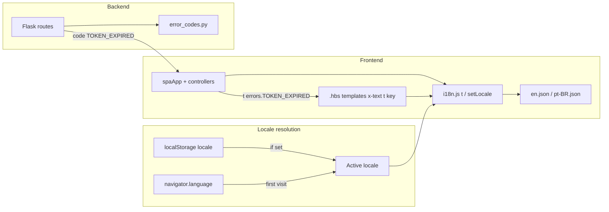

# Internationalization (English + Portuguese) — Design Spec

**Date:** 2026-06-22  
**Status:** Approved  
**Scope:** Frontend i18n module, locale files (`en`, `pt-BR`), API error codes, language switcher, tests, `frontend/AGENTS.md` recipe

## Problem

The Vanilla WebApp Framework is English-only. All user-facing strings are hardcoded across six `.hbs` templates, JavaScript controllers, SEO metadata in `pages.js`, and Flask API error responses. Forks targeting Brazilian users need Portuguese without duplicating templates or coupling API text to a single language.

## Goals

1. Support **English (`en`)** and **Brazilian Portuguese (`pt-BR`)** across the full UI.
2. Use **browser locale detection** on first visit with a **user override** persisted in `localStorage`.
3. Keep the API **language-neutral** via stable error **codes**; the frontend maps codes to localized strings.
4. Make adding future languages (e.g. Spanish) a frontend-only change (new JSON file + switcher entry).
5. Match existing stack conventions: vanilla JS, Alpine.js, Vite — no heavy i18n library.

## Non-goals

- URL-based locale routing (`/pt/…`) or locale-specific canonical URLs
- Server-side rendering or prerender per locale
- User profile locale persistence in the database
- Translating Swagger UI or API demo payloads (`GET /api/data` message field)
- Pluralization rules or ICU message format (not needed for current strings)
- European Portuguese (`pt-PT`) as a separate locale in v1

## Decisions (approved)

| Decision | Choice |
|----------|--------|
| Scope | **C** — API returns error codes; frontend owns all human-readable text |
| Frontend approach | Lightweight custom `i18n.js` + JSON locale files (not i18next, not dual templates) |
| Locale detection | Browser default (`navigator.language`) + user override via switcher |
| Supported locales | `en`, `pt-BR` |
| Fallback chain | Unknown browser tags → `en`; missing translation key in `pt-BR` → `en` |
| Portuguese mapping | `pt`, `pt-BR`, `pt-PT` → `pt-BR` |
| Switcher placement | Context-aware: welcome page header + logged-in sidebar; hidden on login/register |
| Switcher UI | Compact **EN \| PT** text toggle (not flags) |

## Architecture



### Locale resolution order

1. `localStorage.getItem('locale')` — user override wins
2. `navigator.language` — map `pt*` → `pt-BR`; all others → `en`
3. Hard fallback: `en`

## Frontend i18n module

### File layout

```
frontend/src/
├── locales/
│   ├── en.json          # English strings (source of truth for keys)
│   └── pt-BR.json       # Brazilian Portuguese
└── js/
    └── i18n.js          # resolveLocale, t, setLocale, getLocale, initLocale
```

### JSON key structure

Nested dot-notation keys, grouped by domain:

```json
{
  "common": { "loading": "Loading...", "login": "Login" },
  "menu": { "dashboard": "Dashboard", "logout": "Logout" },
  "login": { "title": "Vanilla WebApp Demo", "username": "Username" },
  "errors": {
    "USERNAME_REQUIRED": "Username is required",
    "INVALID_CREDENTIALS": "Invalid credentials",
    "TOKEN_EXPIRED": "Token has expired"
  },
  "seo": {
    "welcome": {
      "title": "Vanilla WebApp Framework — Ship your SaaS faster",
      "description": "…"
    }
  }
}
```

`en.json` defines every key. `pt-BR.json` mirrors the same structure. Missing keys in `pt-BR` fall back to `en` at runtime.

### Public API (`i18n.js`)

| Function | Purpose |
|----------|---------|
| `resolveLocale(navigatorLang?)` | Map browser tag → `en` or `pt-BR` |
| `getLocale()` | Current active locale |
| `initLocale()` | Read `localStorage` or browser; set `<html lang>`; return locale |
| `setLocale(locale)` | Persist, update `lang`, dispatch `localechange` event |
| `t(key, params?)` | Lookup `"login.title"`; support `{name}` interpolation |
| `tError(code)` | Shorthand for `t('errors.' + code)` with `UNKNOWN_ERROR` fallback |

Vite statically imports both JSON files at build time (no lazy loading needed for two locales).

### Alpine integration

Expose on `spaApp` in `createSpaApp()`:

```javascript
locale: initLocale(),
t(key, params) { return t(key, params); },
tError(code) { return tError(code); },
setLocale(locale) {
    setLocale(locale);
    this.locale = getLocale();
    this.refreshMountedPages();
},
```

`refreshMountedPages()` re-calls `loadPage()` on visible containers only:

| App state | Containers refreshed |
|-----------|---------------------|
| Not logged in, welcome | `public-container` |
| Not logged in, login/register | `login-register-container` |
| Logged in | `menu-container`, `view-container` |

Then re-applies SEO for the active page.

### Controller usage

```javascript
// Client validation
this.error = this.appContext.t('errors.USERNAME_REQUIRED');

// API error response
const data = await response.json();
this.error = this.appContext.tError(data.code);
```

Controllers receive `appContext` via existing `init(appContext)` pattern.

## Template integration

`.hbs` files remain static HTML + Alpine directives. Hardcoded English becomes `t()` bindings:

```html
<h1 class="..." x-text="t('login.title')"></h1>
<button :aria-label="t('common.toggleDarkMode')" ...>
```

Dynamic strings in controllers (carousel labels, copy feedback, OAuth hints) use locale keys and `t()` in JS or template fallbacks:

```html
<span x-text="welcomeController.copyFeedback || t('welcome.copyCommand')"></span>
```

### Untranslated content

- Brand names: "Vanilla WebApp", "Google", "Facebook"
- Code snippets, shell commands, env var names (`.env`, `GOOGLE_CLIENT_ID`)
- API JSON debug output (`JSON.stringify(response)`)

### SEO in `pages.js`

Store translation keys instead of literal strings:

```javascript
seo: {
  visibility: 'public',
  titleKey: 'seo.welcome.title',
  descriptionKey: 'seo.welcome.description',
},
```

`applySeo()` resolves keys via `t()` before setting `document.title` and meta tags.

### First-pass translation scope

All six templates, all controller validation/error strings, all SEO keys, and `index.html` default meta (overwritten on boot). Welcome page is the largest (~300 lines).

## API error code contract

### Response shape

```json
{ "code": "INVALID_CREDENTIALS" }
```

Success responses without user-facing text stay unchanged (`{ "token": "…" }`). Registration success becomes `{ "code": "USER_CREATED" }`.

### Error code registry (`backend/api/error_codes.py`)

| Code | HTTP | Used in |
|------|------|---------|
| `TOKEN_MISSING` | 401 | `@token_required` |
| `TOKEN_EXPIRED` | 401 | `@token_required` |
| `INVALID_TOKEN` | 401 | `@token_required` |
| `INVALID_CREDENTIALS` | 401 | `POST /api/login` |
| `USERNAME_PASSWORD_REQUIRED` | 400 | `POST /api/register` |
| `USERNAME_EXISTS` | 400 | `POST /api/register` |
| `REGISTRATION_FAILED` | 500 | `POST /api/register` |
| `PROVIDER_NOT_CONFIGURED` | 404 | OAuth routes |
| `NOT_FOUND` | 404 | Global 404 handler |
| `INTERNAL_ERROR` | 500 | Global 500 handler |
| `AUTH_FAILED` | — | OAuth redirect fragment (frontend-only mapping) |

Success code:

| Code | HTTP | Used in |
|------|------|---------|
| `USER_CREATED` | 201 | `POST /api/register` |

Helper:

```python
def error_response(code: str, status: int):
    return jsonify({'code': code}), status
```

### OAuth redirect fragment

Change from plain text to code:

```
/#auth_error=AUTH_FAILED
```

`handleOAuthFragment()` in `app.js` calls `tError('AUTH_FAILED')`.

### Client-only error keys (frontend locale files only)

| Key | Source |
|-----|--------|
| `USERNAME_REQUIRED`, `PASSWORD_REQUIRED` | Login controller validation |
| `PASSWORD_TOO_SHORT`, `PASSWORDS_DO_NOT_MATCH` | Register controller validation |
| `LOGIN_FAILED`, `REGISTRATION_FAILED`, `REQUEST_FAILED` | Generic fetch fallbacks |
| `OAUTH_NOT_CONFIGURED` | `app.js` OAuth env hint (with `{provider}` interpolation) |
| `UNKNOWN_ERROR` | `tError()` fallback for unrecognized API codes |

### Backward compatibility

Breaking change for consumers reading `message`. Acceptable for this framework starter. Pytest assertions update to check `code`. Swagger YAML descriptions remain human-readable (document behavior, not response body text).

## Language switcher UI

Compact **EN | PT** toggle bound to `spaApp.setLocale()`:

```html
<div class="flex items-center gap-1 text-sm" role="group" aria-label="Language">
  <button type="button" @click="setLocale('en')"
          :class="locale === 'en' ? 'font-semibold text-indigo-600' : 'text-gray-500'"
          :aria-pressed="locale === 'en'">EN</button>
  <span class="text-gray-300" aria-hidden="true">|</span>
  <button type="button" @click="setLocale('pt-BR')"
          :class="locale === 'pt-BR' ? 'font-semibold text-indigo-600' : 'text-gray-500'"
          :aria-pressed="locale === 'pt-BR'">PT</button>
</div>
```

### Placement

| Screen | Location |
|--------|----------|
| Welcome page | Header, between dark-mode toggle and "Sign In" |
| Logged-in app | Sidebar footer, above dark-mode toggle |
| Login / Register | Hidden (locale persists from prior choice) |

### On switch

1. Persist to `localStorage`
2. Update `document.documentElement.lang`
3. `refreshMountedPages()` on visible containers
4. Re-apply localized SEO

Welcome carousel state resets on locale switch (acceptable v1 trade-off; `initCarousel()` re-runs).

## SEO and `html lang`

- `initLocale()` and `setLocale()` set `<html lang="en">` or `<html lang="pt-BR">`
- `index.html` keeps `lang="en"` as static default (JS overwrites on boot)
- No URL-based locale routing; canonical URLs stay locale-agnostic
- Most pages are `noindex` under default `auth-first` SEO mode

## Testing

### Frontend (Vitest)

| File | Covers |
|------|--------|
| `i18n.test.js` (new) | `resolveLocale()` mapping; `t()` lookup + key fallback; `{param}` interpolation; `tError()` + unknown code |
| `pages.test.js` (update) | SEO keys resolve via `t()` |
| Existing controller tests (update) | Error paths use codes + `tError()` where applicable |

### Backend (pytest)

| File | Covers |
|------|--------|
| `test_auth.py` (update) | Assert `code` field on 401/400/201 responses |
| `web_routes` error handler tests (update if present) | `NOT_FOUND`, `INTERNAL_ERROR` codes |

## Documentation

- **`frontend/AGENTS.md`**: Add i18n recipe — file layout, how to add keys, how to add a new locale, template/controller patterns.
- **README**: No update (no env var, run command, or setup change).
- **`.env.example`**: No update.

## Adding a future language (e.g. Spanish)

1. Add `frontend/src/locales/es.json` mirroring `en.json`
2. Register `es` in `i18n.js` `SUPPORTED_LOCALES` and `resolveLocale()` mapping
3. Add switcher button
4. No backend changes

## Verification checklist (implementation)

- [ ] `cd frontend && npm run test` — i18n + updated tests pass
- [ ] `pytest` — auth/error response tests pass
- [ ] `cd frontend && npm run build && npm run test`
- [ ] Manual: welcome page in EN and PT; switcher on header and sidebar
- [ ] Manual: login/register show localized validation and API errors
- [ ] Manual: `<html lang>` updates on switch; tab title localized on public welcome page
