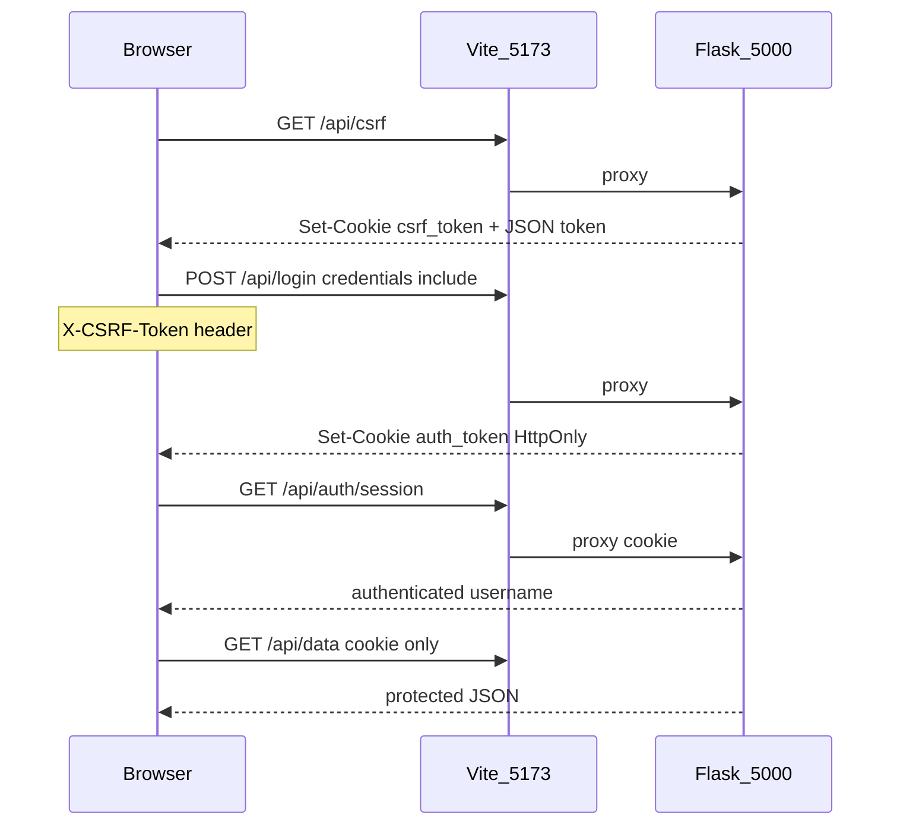

# Technical Debt Remediation — Design Spec

**Date:** 2026-07-05  
**Status:** Approved for implementation  
**Scope:** Full roadmap (8 phases) from the technical-debt review  
**Auth decision:** httpOnly Secure cookies + double-submit CSRF (user confirmed)

## Purpose

Harden the Vanilla WebApp Framework template for production forks: fix config/repo bugs, replace localStorage JWT with cookie sessions, add CSRF and CORS restrictions, improve backend reliability, SPA UX, CI, and documentation accuracy.

## Improvements over the initial plan

| Topic | Initial plan | This design |
|-------|--------------|-------------|
| OAuth linking | "link OR return ACCOUNT_EXISTS" (ambiguous) | **Auto-link** OAuth to existing password user when `email` matches and user has no OAuth identity |
| Webhook 500 vs 400 | Phase 5, idempotency as note | **IntegrityError handling first**, then 500 for processing failures |
| Register UX | Cookie only on login | **Set auth cookie on register** so user is logged in immediately |
| Cookie name | `access_token` | `auth_token` (avoid generic collisions) |
| CSRF pattern | cookie OR header | **Double-submit**: readable `csrf_token` cookie + matching `X-CSRF-Token` header |
| Bearer fallback | Keep for tests | Keep for tests, Swagger, and programmatic API clients |
| Phase 6 overlap | No-reload split across phases | Login/logout no-reload completed in Phase 2; Phase 6 adds History API + menu placeholders |

## Architecture



## Phase 1 — Repository hygiene

- Fix [`.gitignore`](.gitignore) line 50 split
- `git rm` tracked [`frontend/backend/static/`](frontend/backend/static/)
- [`backend/config/app_config.py`](backend/config/app_config.py): load `.env` from project root via `Path(__file__).resolve().parents[2]`

## Phase 2 — Cookie auth + CSRF + CORS

### New modules

- [`backend/api/session_auth.py`](backend/api/session_auth.py): cookie set/clear/read, `AUTH_COOKIE_NAME = 'auth_token'`
- [`backend/api/csrf.py`](backend/api/csrf.py): `GET /api/csrf`, `@csrf_protect` decorator
- [`frontend/src/js/api.js`](frontend/src/js/api.js): `initCsrf()`, `apiFetch()`

### Auth endpoints

| Route | CSRF | Cookie |
|-------|------|--------|
| `GET /api/csrf` | No | Sets `csrf_token` |
| `GET /api/auth/session` | No | Reads `auth_token` |
| `POST /api/login` | Yes | Sets `auth_token` |
| `POST /api/register` | Yes | Sets `auth_token` after create |
| `POST /api/logout` | Yes | Clears `auth_token` |
| Webhooks | No | N/A |

### OAuth

- Callback sets `auth_token` cookie; redirects to `FRONTEND_URL/?auth=success` or `?auth_error=CODE`
- Remove JWT from URL fragment entirely

### CORS

- `CORS_ORIGINS` env (comma-separated); default `[FRONTEND_URL]`
- `supports_credentials=True`

## Phase 3 — Security hardening

- Flask-Limiter on login/register (10/min/IP)
- Security headers via `@app.after_request`
- Disable Swagger when `APP_PROFILE=production` unless `SWAGGER_ENABLED=true`
- Password min length 8 (align backend with frontend validation)
- Remove broad `@app.errorhandler(Exception)`

## Phase 4 — Accounts

- Alembic `005_user_is_active.py`: `is_active BOOLEAN DEFAULT true`
- `@token_required` rejects inactive users (`ACCOUNT_INACTIVE`)
- OAuth `find_or_create_oauth_user`: link by email to existing user without OAuth

## Phase 5 — Backend reliability

- Health check: DB `SELECT 1`, 503 on failure
- Webhook: insert event first, catch `IntegrityError` for duplicates; 400 verify / 500 process
- `spend_credits`: remove internal commit
- `database.py`: prefer `AppConfig` URI when initialized
- UTC-aware datetimes in JWT and billing
- Lazy `app` creation in `backend/app.py` only

## Phase 6 — Frontend UX

- History API: public paths `/` → welcome; logged-in paths `/app/:pageKey`
- Placeholder Settings/Profile pages or hide nav items
- Update [`frontend/AGENTS.md`](frontend/AGENTS.md) debt register

## Phase 7 — CI

- `flake8 backend`, `mypy backend` in CI
- New tests: CSRF, session, health, api.js

## Phase 8 — DevOps

- Docker README: Postgres recommended, gunicorn workers=1 for SQLite
- Stub [`.github/workflows/deploy.yml`](.github/workflows/deploy.yml)

## Error codes (new)

- `CSRF_INVALID`
- `ACCOUNT_INACTIVE`
- `PASSWORD_TOO_SHORT` (backend, align with frontend)

## Testing gates (each phase)

```bash
pytest
cd frontend && npm run build && npm run test
```

## Out of scope

- Stripe adapter implementation
- DigitalOcean full deploy automation
- Flask-SQLAlchemy migration
- SSR/prerender (documented as fork recipe only)
